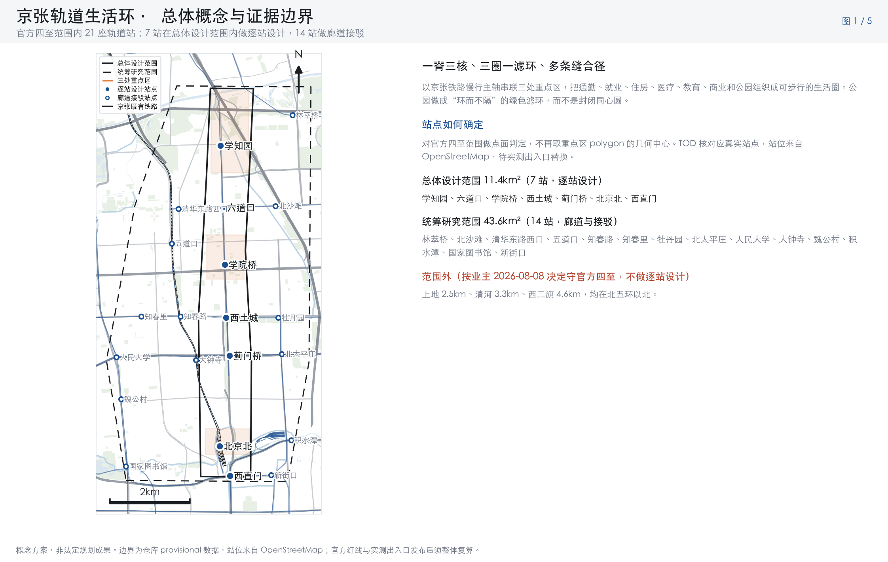
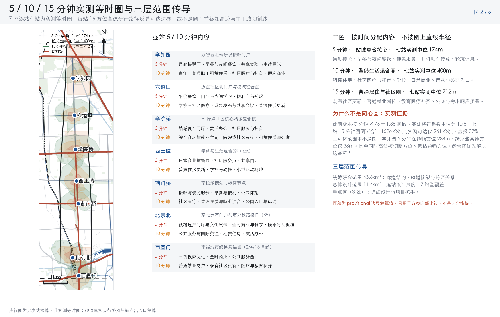
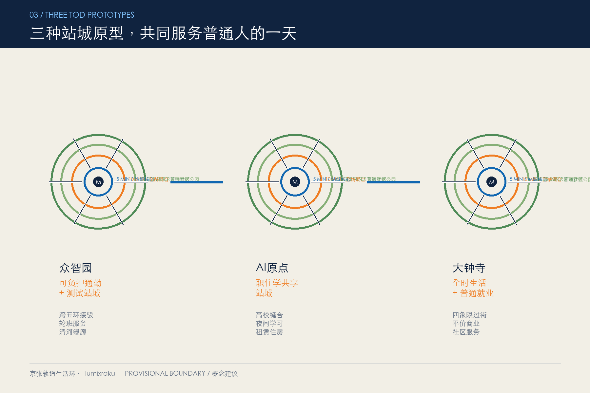
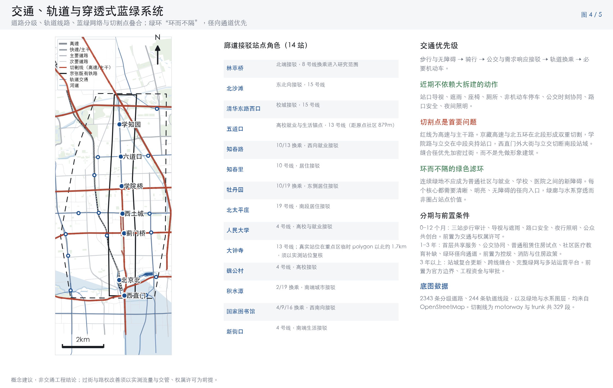
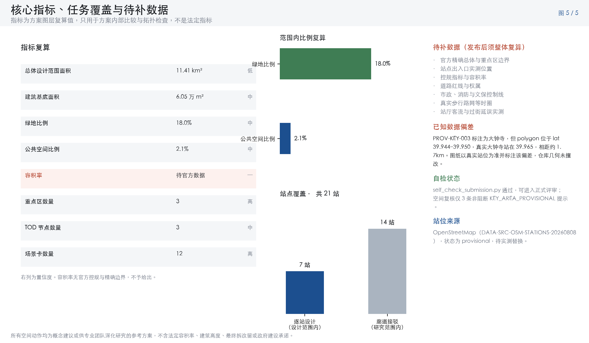

# 京张轨道生活环：面向普通人的全时 TOD 城市

> **Rail-Life Rings / TOD for Everyday People**
>
> 让城市围着人的时间转，而不是让普通人围着单一产业和办公区转。



## 一句话提案

以京张铁路慢行主轴串联众智园、AI 原点社区和大钟寺三个概念 TOD 节点，把通勤、就业、住房、医疗、教育、商业和公园组织成三组可步行的 5/10/15 分钟生活圈。

这不是把公园做成封闭的同心圆，而是做成“环而不隔”的绿色滤环：保留公园围绕核心的城市意象，同时用东西向缝合径和无障碍路径直达普通社区、高校、园区和车站。

## 空间结构

方案名称是 **“一脊三核、三圈一滤环、多条缝合径”**：

- **一脊**：京张南北绿色通勤脊，连接铁路文化、轨道换乘和日常生活。
- **三核**：锚定在三座具体车站上——**学知园**（27 号线，众智园通勤核）、**学院桥**（27 号线，AI 原点共享核）、**北京北**（市郊铁路 S5，大钟寺生活核），形成分布式 TOD 珠链，而不是单一超级中心。
- **三圈**：5 分钟站城复合核心、10 分钟全龄生活混合圈、15 分钟普通居住与社区圈，半径从真实站位起算。
- **一滤环**：连续树荫、雨洪空间、运动休憩和公园绿地组成可穿越的绿色网络。
- **缝合径**：优先解决铁路、主干路、围墙、天桥、电梯和站内换乘造成的实际绕行。

### 站点口径与分类

对公告四至范围内的轨道站做点面判定，共 21 座车站：**7 座**在 11.4 平方公里总体设计范围内做逐站设计，**14 座**在 43.6 平方公里统筹研究范围内做廊道接驳。7 座逐站设计车站按“区位层级 × 换乘量级 × 站域现状”分三类：

| 类别 | 车站 | 设计重点 |
| --- | --- | --- |
| 城市级换乘锚点 | 西直门（2/4/13 号线）、北京北（S5） | 换乘连续性与导视优先，以更新为主不做大拆大建；北京北承担京张遗产门户 |
| 站城复合核心 | 学院桥（27 号线）、学知园（27 号线） | 站城一体首层、复合门厅、径向绿廊穿透 |
| 社区接驳站 | 六道口（15/27 号线）、西土城（10/27 号线）、蓟门桥（27 号线） | 缝合径与过街加密，首层业态激活，避免纯办公 |

站域范围以**车站出入口**为原点按实际步行可达界定，不用车站中心的直线半径：半径取 `分钟 × 75 米/分 ÷ 1.35 绕行系数`，即 5 分钟 278 米、10 分钟 556 米、15 分钟 833 米。上地、清河、西二旗距最近重点区 2.5 至 4.6 公里且均在北五环以北，按公告四至不做逐站设计。



## 三个重点节点

### 众智园：可负担通勤与测试站城

主站**学知园**（27 号线），车站落在重点区内部。站域问题是东侧京藏高速与北五环双重切割，出闸后须绕行至最近过街点。5 分钟圈安排通勤接驳厅、早餐与夜间餐饮、共享实验和轮班工作者休息；10 分钟圈补充青年及普通职工租赁住房、社区医疗和托育；绿色滤环承载低速接驳、无障碍导航和雨洪管理测试。近期抓手：跨京藏高速人行天桥或地道加宽、站口 200 米内连续无障碍步道与雨棚、园区围墙开口形成站到园直连。

### AI 原点社区：职住学共享站城

主站**学院桥**（27 号线）在重点区内，同区还有**六道口**（15/27 号线，距边界 684 米）与**西土城**（10/27 号线，958 米）。站域问题是立交桥区人车混行、导视缺失、桥下空间闲置，六道口被学院路主干与校园围墙夹持。5 分钟圈设置站城复合门厅、共享会议、成果发布、平价餐饮和夜间学习空间；10 分钟圈混合学校、社区医疗、商场、公寓和普通住房；径向绿廊保证儿童和老年人也能独立使用。近期抓手：桥下空间改造为有照明的步行连廊、四向连续过街与统一导视、学院路行人相位优先。

### 大钟寺：全时生活与普通就业站城

落在该重点区 provisional polygon 内的车站是**北京北**（市郊铁路 S5），南侧为**西直门**（2/4/13 号线，531 米）。这里是“铁道 TOD”特征最集中处：北京北是干线铁路接口而非地铁，承担京张遗产门户，与西直门属跨制式换乘，是全廊道最长、指引最弱的一段。不只服务高科技白领，也服务零售、物业、配送、医护和周边居民。近期先做换乘通道连续化与统一导视、站前广场机动车与步行分离、非机动车停车；核心区混合日常商业、灵活办公、公共服务和租赁住房；公园滤环连接普通社区，而不是圈占站点价值。

> 数据偏差：仓库 `PROV-KEY-003` 标注为大钟寺，但其 polygon 在纬度 39.944–39.950，真实大钟寺站（13 号线）在 39.965，相距约 1.7 公里。图纸以真实站位为准并标注该偏差，仓库几何未擅改。

### 蓟门桥：绿脊中段的社区接驳站

**蓟门桥**（27 号线）不属于任何重点区，距第三处重点区约 1.8 公里，位于慢行脊中段。站域问题是主干路切断东西向步行联系。作用是保证慢行脊中段不断开，使三处重点区之间可连续步行，而不是另设开发核心。近期抓手：东西向过街加密、绿脊在此段连通而不做封闭隔离带、站口公共休憩与遮阴。



## 服务谁

方案优先服务跨区打工人、服务业和轮班人员、周边普通家庭、老年人和行动不便者、高校学生和青年、小商户与配送人员。

他们面对的不是抽象的“城市效率”问题，而是：换乘不稳定、最后一公里太长、早晚班交通不足、住房离岗位太远、上学看病需要多次出行、无障碍链路中断、装卸停车与客流冲突。

因此，首层服务优先于形象建筑，既有社区更新优先于大拆大建，实际出闸到目的地时间优先于地图上的直线半径。

## AI 场景

AI 只作为辅助工具，不监控普通人，也不替代医疗、交通、规划和公共安全专业判断。

- AI 通勤管家：整合公开时刻、拥堵提示和无障碍信息，不追踪个人。
- 需求响应接驳：连接 15 分钟圈，同时保留固定线路兜底。
- 无障碍全链路审计：由残障人士、老人和志愿者授权反馈，AI 只归类问题，专业人员现场确认。
- 轮班人员夜行守护：报告照明和设施故障，不做人脸识别。
- 学医商一站导航：导航到学校、医疗和日常商业，不提供诊断。
- 分时路权与装卸调度：聚合商户时段需求，人工审批规则。
- 低速配送共用舱：封闭路段、小规模、限时、可退出，设置现场安全员和投诉停机机制。
- 客流数字孪生沙盒：只用公开或匿名聚合数据比较换乘方案，不输出法定结论。
- 公园运维智能体：识别设施巡检任务，不识别人，维护团队确认后派单。
- 通勤成本仪表盘：发布分组后的步行、等待、换乘和费用指标，禁止个体排名。
- 普通就业技能站：提供 AI 基础技能和岗位信息，人工审核招聘内容。
- TOD 公众共创台：展示方案、收集授权意见，同时保留线下渠道。

共同原则是数据最小化、用途限定、可解释、可退出和人工复核。

## 交通与公共空间

交通优先级为：步行和无障碍、骑行、公交与需求响应接驳、轨道换乘、必要机动车。

近期不依赖大拆建的动作包括站口导视、遮雨、座椅、厕所、非机动车停车、公交时刻协同、路口安全和夜间照明。中期再讨论站城首层重组、接驳路线和公共服务补缺。

**换乘与接驳。** 换乘按“同站换乘优先于出站换乘，出站换乘必须连续可导视”组织。关键换乘点为西直门（三线）、北京北至西直门（跨制式，市郊铁路与地铁，全廊道最长最弱的一段，列为近期首要），以及六道口、西土城、知春路、牡丹园、积水潭、国家图书馆等双线换乘站。公交与需求响应接驳按轮班时刻而非仅高峰编排。

**站城一体是首层连续性问题，不是盖综合体。** 车站出入口、公交站台、非机动车停放、人行系统和建筑首层应在同一标高连续贯通，避免出闸后再上下天桥。非机动车在出入口 50 米内集中停放并清理占道。小汽车换乘（P+R）不在西直门、学院桥等高强度建成区设置，只在廊道北端外围结合既有停车资源讨论，须以停车调查与交通影响评价为前置。

**密度梯度只给相对关系。** 站点出入口周边最高、向外递减，15 分钟圈以既有社区更新维持而非新建强度。官方控规与精确边界未发布，容积率保持 unknown，本方案不给具体数值。

公园采用“环而不隔”的绿色滤环。连续绿地不应成为普通社区与就业、学校、医院之间的新障碍；每个核心都需要清晰、明亮、无障碍的径向入口。

**廊道接驳的 14 座车站**只做接驳与角色定位：林萃桥（8）、北沙滩（15）、清华东路西口（15）、五道口（13）、知春路（10/13）、知春里（10）、牡丹园（10/19）、北太平庄（19）、人民大学（4）、大钟寺（13）、魏公村（4）、积水潭（2/19）、国家图书馆（4/9/16）、新街口（4）。作用是把研究范围内的就业、高校与居住接入本廊道，而不是各自另做站城开发。



## 分期路径

| 时间 | 优先行动 | 前置条件 |
| --- | --- | --- |
| 0-12 个月 | 三站步行审计、导视与遮雨、路口安全、夜行照明、公众共创台 | 交通与权属许可；测量出闸到目的地时间、无障碍完成率和投诉闭环 |
| 1-3 年 | 首层共享服务、公交协同、普通租赁住房试点、社区医疗教育补缺、绿环径向通道 | 控规、消防、运营与住房政策 |
| 3 年以上 | 站城复合更新、跨线缝合、完整公园绿网和多站运营平台 | 官方边界、工程、资金及审批；分项目专业论证 |

年度运营概念是：**一日一站、一月一诊断、一季一开放、一年一复盘**。

## 指标与边界

当前临时总体范围约 **11.4 平方公里**。绿地比例、公共空间比例、建筑基底和重点区域数量均为方案图层复算值，只用于比较方案内部关系和进行拓扑检查，不是法定指标。

仓库目前没有官方精确边界、站点、控规、权属、道路红线、市政、消防和文保数据。因此：

- 所有空间动作都是概念建议或供专业团队深化研究的参考方案。
- 三处重点区域的几何范围明确标记为 provisional。
- 不给出法定容积率、建筑高度、最终拆改留或政府建设承诺。
- 正式官方几何发布后，应统一重新计算面积、比例和空间关系。



## 风险控制

主要风险包括 TOD 推高租金、绿环变成隔离带、直线半径掩盖实际绕行、AI 建议替代现场调研，以及夜间和客流数据侵害隐私。

对应措施是住房和小商业保障前置、径向通道核查、真实步行网络审计、AI 只做辅助、所有项目降级为概念建议、数据最小化和人工复核。

## 完整成果

- [正式方案正文](submissions/lumixraku/rail-life-rings/proposal.md)
- [离线可视化页面](submissions/lumixraku/rail-life-rings/visual/index.html)
- [A3 方案册](submissions/lumixraku/rail-life-rings/drawings/a3-booklet.pdf)
- [A0 展板](submissions/lumixraku/rail-life-rings/drawings/a0-boards.pdf)
- [结构化空间数据](submissions/lumixraku/rail-life-rings/geometry/)
- [来源与版权说明](submissions/lumixraku/rail-life-rings/report/copyright_statement.md)

## 自检状态

本方案已通过仓库完整自检，可以进入正式评审：

```text
Deterministic validation: PASS
Spatial review: PASS
Visual packaging check: PASS
Professional evidence review: PASS
Review status: formal-review-ready
```

空间审查仍会提示三处 `KEY_AREA_PROVISIONAL`，这是对官方重点区域边界缺失的明确披露，不是阻塞错误。
